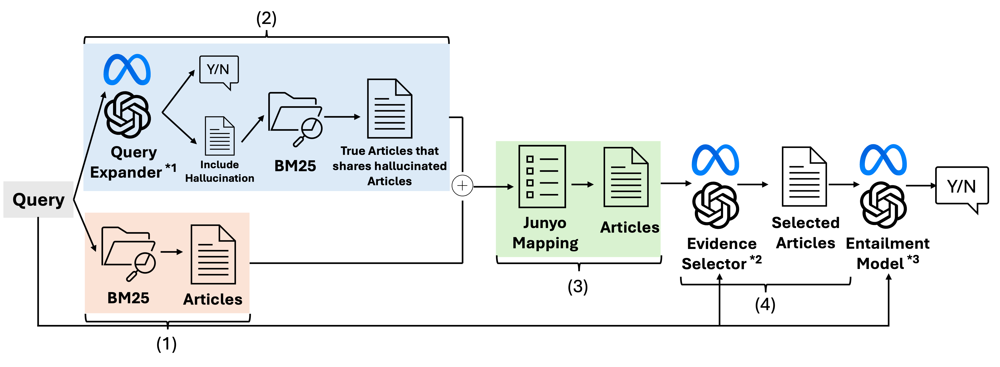

# End-to-End Legal Entailment with Statute Retrieval


This repository contains the code and experiment results for an end-to-end legal entailment system that uses statute retrieval to mitigate LLM hallucinations. The work targets COLIEE Task3 (Statute Retrieval) and Task4 (Legal Textual Entailment) and evaluates multiple retrieval/selection strategies on the R05 (2024) and R06 (2025) datasets.

## Research Summary

### Problem

Legal entailment for civil code questions requires identifying the correct statutes and reasoning over them. Naive end-to-end LLM answers can hallucinate statutes or omit necessary cross-references (mutatis mutandis), degrading reliability.

### Proposed Approach

[](system_figure_thesis.pdf)

1. **End-to-End baseline**: LLM answers without retrieval (Experiment 1).
2. **BM25 RAG**: retrieve top-k statutes with BM25 and provide them as context (Experiment 2).
3. **LLM-guided retrieval + selection**: use LLM-generated query expansion and evidence selection, plus junyo (mutatis mutandis) mapping to refine the statute set before entailment (Experiment 3).

## Datasets

- **R05 (COLIEE 2024)**: 109 problems.
- **R06 (COLIEE 2025)**: 73 problems.
- Dataset files are not included in this repository. See the COLIEE website for access.

## References (COLIEE)

1. Rabelo, J., Kim, M. Y., Goebel, R., Yoshioka, M., Kano, Y., & Satoh, K. (2022). Overview and Discussion of the Competition on Legal Information Extraction/Entailment (COLIEE) 2021. Pages 111-133. DOI: 10.1007/s12626-022-00105-z
2. Randy Goebel, Yoshinobu Kano, Mi-Young Kim, Juliano Rabelo, Ken Satoh, and Masaharu Yoshioka. 2024. Overview of&nbsp;Benchmark Datasets and&nbsp;Methods for&nbsp;the&nbsp;Legal Information Extraction/Entailment Competition (COLIEE) 2024. In New Frontiers in Artificial Intelligence: JSAI International Symposium on Artificial Intelligence, JSAI-isAI 2024, Hamamatsu, Japan, May 28–29, 2024, Proceedings. Springer-Verlag, Berlin, Heidelberg, 109–124. https://doi.org/10.1007/978-981-97-3076-6_8
3. Randy Goebel, Yoshinobu Kano, Mi-Young Kim, Calum Kwan, Ken Satoh, Hiroaki Yamada, and Masaharu Yoshioka. 2026. An Overview of the COLIEE 2025 Competition: Legal Case Law and Statute Law Information Retrieval and Entailment. In Proceedings of the Twentieth International Conference on Artificial Intelligence and Law (ICAIL '25). Association for Computing Machinery, New York, NY, USA, 506–515. https://doi.org/10.1145/3769126.3785016

## Models

Experiments run local models via Ollama with an OpenAI-compatible API. Runs were performed on a Mac Studio (M3 Ultra, 512GB).

- `gpt-oss:120b`
- `llama4:128x17b`

## Results

### Experiment 1: End-to-End (Accuracy)

| Dataset | Model   | Accuracy |
|---------|---------|----------|
| R05     | gpt-oss | 49.54    |
| R05     | llama4  | 66.97    |
| R06     | gpt-oss | 46.58    |
| R06     | llama4  | 53.42    |

### Experiment 2: BM25 RAG (F2 / Precision / Recall / Accuracy)

| Dataset | Model   | k  | F2     | Precision | Recall | Accuracy |
|---------|---------|----|--------|-----------|--------|----------|
| R05     | gpt-oss | 5  | 0.4501 | 0.1761    | 0.7661 | 77.06    |
| R05     | gpt-oss | 10 | 0.3131 | 0.0936    | 0.8028 | 82.57    |
| R05     | gpt-oss | 15 | 0.2425 | 0.0648    | 0.8257 | 81.65    |
| R05     | llama4  | 5  | 0.4501 | 0.1761    | 0.7661 | 75.23    |
| R05     | llama4  | 10 | 0.3131 | 0.0936    | 0.8028 | 78.90    |
| R05     | llama4  | 15 | 0.2425 | 0.0648    | 0.8257 | 84.40    |
| R06     | gpt-oss | 5  | 0.4694 | 0.1863    | 0.7922 | 78.85    |
| R06     | gpt-oss | 10 | 0.3401 | 0.1027    | 0.8607 | 73.97    |
| R06     | gpt-oss | 15 | 0.2621 | 0.0703    | 0.8881 | 69.86    |
| R06     | llama4  | 5  | 0.4694 | 0.1863    | 0.7922 | 76.71    |
| R06     | llama4  | 10 | 0.3401 | 0.1027    | 0.8607 | 73.97    |
| R06     | llama4  | 15 | 0.2621 | 0.0703    | 0.8881 | 79.45    |

### Experiment 3: LLM-Guided Retrieval + Add Junyo Articles

| Dataset | Model   | k | F2     | Precision | Recall | BM25  | LLM  | Junyo | Accuracy |
|---------|---------|---|--------|-----------|--------|-------|------|-------|----------|
| R05     | gpt-oss | 1 | 0.4124 | 0.1519    | 0.7752 | 76.61 | 0.46 | 0.46  | 83.49    |
| R05     | gpt-oss | 2 | 0.4008 | 0.1446    | 0.7844 | 76.61 | 0.46 | 0.46  | 80.73    |
| R05     | gpt-oss | 3 | 0.3872 | 0.1362    | 0.7890 | 76.61 | 0.46 | 0.46  | 81.65    |
| R05     | llama4  | 1 | 0.4160 | 0.1502    | 0.8073 | 76.61 | 0.46 | 0.46  | 76.15    |
| R05     | llama4  | 2 | 0.3961 | 0.1403    | 0.8073 | 76.61 | 0.46 | 0.46  | 73.39    |
| R05     | llama4  | 3 | 0.3808 | 0.1312    | 0.8165 | 76.61 | 0.46 | 0.46  | 73.39    |
| R06     | gpt-oss | 1 | 0.4560 | 0.1682    | 0.8607 | 79.22 | 4.11 | 2.74  | 86.30    |
| R06     | gpt-oss | 2 | 0.4362 | 0.1559    | 0.8607 | 79.22 | 4.11 | 2.74  | 82.19    |
| R06     | gpt-oss | 3 | 0.4248 | 0.1485    | 0.8790 | 79.22 | 5.94 | 2.74  | 84.93    |
| R06     | llama4  | 1 | 0.4391 | 0.1602    | 0.8402 | 79.22 | 1.37 | 3.42  | 75.34    |
| R06     | llama4  | 2 | 0.4287 | 0.1535    | 0.8584 | 79.22 | 3.20 | 3.42  | 73.97    |
| R06     | llama4  | 3 | 0.4199 | 0.1448    | 0.8927 | 79.22 | 6.62 | 3.42  | 75.34    |

### Experiment 3 (LLM Selection Results)

| Dataset | Model   | k | F2     | Precision | Recall | Accuracy |
|---------|---------|---|--------|-----------|--------|----------|
| R05     | gpt-oss | 1 | 0.7042 | 0.6820    | 0.7339 | 85.32    |
| R05     | gpt-oss | 2 | 0.7112 | 0.6881    | 0.7431 | 85.32    |
| R05     | gpt-oss | 3 | 0.7199 | 0.6896    | 0.7523 | 85.32    |
| R05     | llama4  | 1 | 0.7161 | 0.6468    | 0.7615 | 79.82    |
| R05     | llama4  | 2 | 0.7214 | 0.6506    | 0.7661 | 79.82    |
| R05     | llama4  | 3 | 0.7125 | 0.6369    | 0.7615 | 79.82    |
| R06     | gpt-oss | 1 | 0.8091 | 0.7854    | 0.8333 | 80.70    |
| R06     | gpt-oss | 2 | 0.7929 | 0.7511    | 0.8265 | 82.14    |
| R06     | gpt-oss | 3 | 0.7915 | 0.7340    | 0.8333 | 84.21    |
| R06     | llama4  | 1 | 0.7742 | 0.7557    | 0.7945 | 82.19    |
| R06     | llama4  | 2 | 0.7925 | 0.7900    | 0.8059 | 82.19    |
| R06     | llama4  | 3 | 0.8181 | 0.7900    | 0.8402 | 82.19    |

## Repository Structure

- `experiments/`: experiment entry points (exp1_zeroshot, exp2_basebm25, exp3_llmguide).
- `src/`: dataset loading, BM25 retrieval, LLM clients, and evaluation utilities.
- `results/`: saved outputs from experiments.

## Setup

```bash
python -m venv .venv
source .venv/bin/activate
python -m pip install -r requirements.txt
```

If you use LLM APIs, set the required environment variables in a `.env` file (examples inferred from the code):

```
GEMINI_API_KEY=...
OLLAMA_URL=http://localhost:11434/v1
OLLAMA_API_KEY=...
```

## Reproducing the Experiments

```bash
python experiments/exp1_zeroshot/main.py
python experiments/exp2_basebm25/main.py
python experiments/exp3_llmguide/main.py
```
